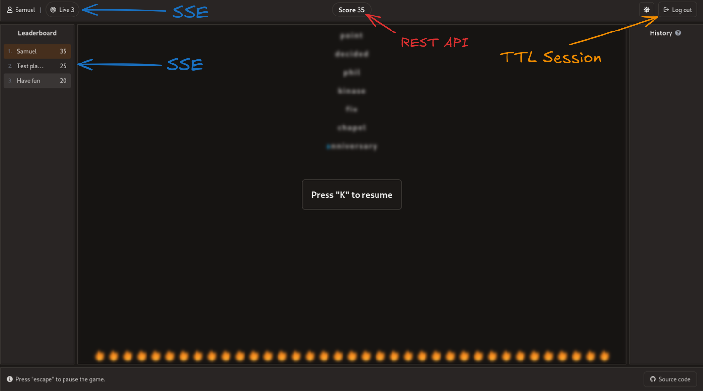
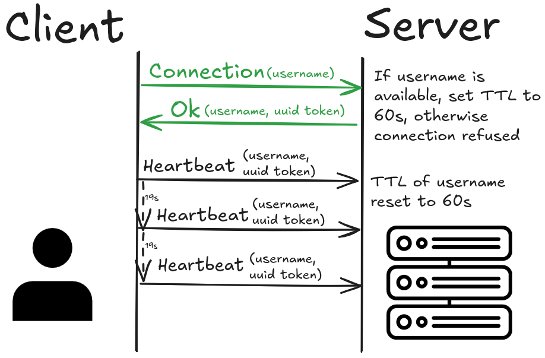
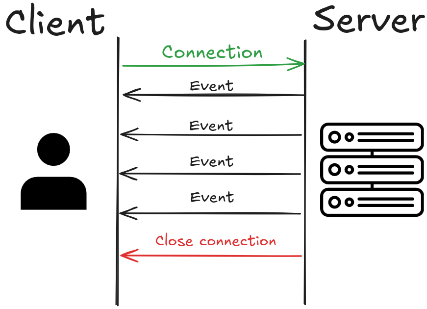

# 🎮 Mini Redis Game Demo

[Click on me to play](https://fast-typing.be)

## Introduction

The goal of this project is to showcase some capabilities of the [miniredis extension](https://github.com/sdemeesterde/mini-redis-extension).

And honestly… what better way than a small game 😉\
This is perfect for demonstrating a standard use case: live ranking.

---

## 🖥️ Frontend

The game engine runs entirely on the client side using React.

### Why?

* **Performance / UX**
  The falling words need to feel smooth regardless of network quality.

* **Simplicity (default choice)**
  The server only receives the score. That’s it.

### Any risks?

You should never trust the client. The server is the source of truth.
A client can inspect and modify requests before sending them.

The server must always ask: *does this look plausible?*

---

### ⚠️ Anti-cheat considerations

Without safeguards, cheating would be trivial:

> Just send a POST request with whatever score you want.

### So what’s the approach?

It’s all about **friction vs reward**.

* Stakes are low
* But cheating is *too easy* to ignore

So we cap score increases to what a human could reasonably achieve (with some margin).

It’s simple and not bulletproof (someone could still send incremental updates), but good enough for this context.

👉 If you manage to break it, feel free to share your hack or open a PR with improvements.
But please, be gentle. It's a hobby project :-)

---

## ⚙️ Backend

### 🔐 Authentication

The goal: **zero-friction onboarding**.
No sign-ups. No forms. No nonsense.

### Why not cookies / local storage?

They don’t handle multiple tabs or sessions well.

### The approach

* First come, first serve username system
* If a username is available -> you get it
* The server returns a UUID token
* This token is used for all subsequent requests

### Edge case?

> Could someone reuse another username?

Yes. But why would someone improve a competing username’s score?
That’s the trade-off.

---

### ⏳ Active users tracking

How does the server know which usernames are “active”?

Using **TTL (Time-To-Live)** from miniredis:

* A claimed username gets a TTL of 60 seconds
* The client sends heartbeat requests to refresh it

If the heartbeat stops -> username becomes available again.

---

### 📡 SSE (Server-Sent Events)

Every score update is broadcast to all connected users.

* Each client receives **score deltas**
* Enough to update rankings locally

Under the hood:

* `tokio::sync` handles message passing

---

### 🧠 Miniredis

For this project, miniredis stores the entire working set.

Constraints are enforced to prevent resource exhaustion and abuse:

- Maximum leaderboard size: 1,000,000 entries
- Maximum username length: 30 characters

Given the lightweight authentication model, these limits help mitigate abuse
(e.g. spamming usernames or scores) and bound memory usage.

### Persistence

* Miniredis is used as an in-memory, non-persistent store (AOF disabled).
* SQLite is the durable source of truth and is updated on each score improvement.
* On application startup, miniredis state is rebuilt from SQLite.

More details here:
👉 `backend/miniredis/README.md`

---

### 📦 BufferedClient

Using the raw `Client` in async code is unsafe:

* risk of interleaved frames
* undefined behavior

So instead:

* `BufferedClient` wraps the client
* Uses message passing internally

Trade-off:

* Single-threaded bottleneck

But that’s fine given the expected workload.

---

### Server

If you're curious about the server setup:
👉 `deploy/README.md`

---

## 📄 License

This project is licensed under the [MIT license](LICENSE).
