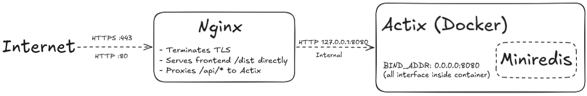

## The request journey end-to-end

```
Browser: POST https://fast-typing.be/api/connection

1. DNS resolves fast-typing.be → your server IP
2. Browser connects to server:443
3. nginx handles TLS handshake (uses Let's Encrypt cert)
4. nginx sees path starts with /api/ → proxy_pass to 127.0.0.1:8080
5. Request arrives at Actix as plain HTTP: POST /api/connection
6. Actix processes it, responds
7. nginx forwards response back to browser over TLS
```

### Setup of the server:

1. Get the TLS cert:
```
sudo systemctl start nginx
sudo certbot --nginx -d fast-typing.be -d www.fast-typing.be
```

2. Create frontend `dist/` folder. Used commands on personal computer with:
```
npm ci
npm run build
```
Then use scp to copy/paste `/dist` folder to `/home/mypersonaluser/typing-game/frontend/dist` on the server.

3. Configure nginx at `/etc/nginx/sites-available/fast-typing.be`. See file `nginx.conf`

4. Set up the systemd service at `/etc/systemd/system/typing-game.service`. See file `typing-game.service`.
Then used the following commands:

```
sudo systemctl daemon-reload
sudo systemctl enable typing-game
sudo systemctl start typing-game
```
Then, to rebuild and restart backend:
```
sudo systemctl restart typing-game
```
